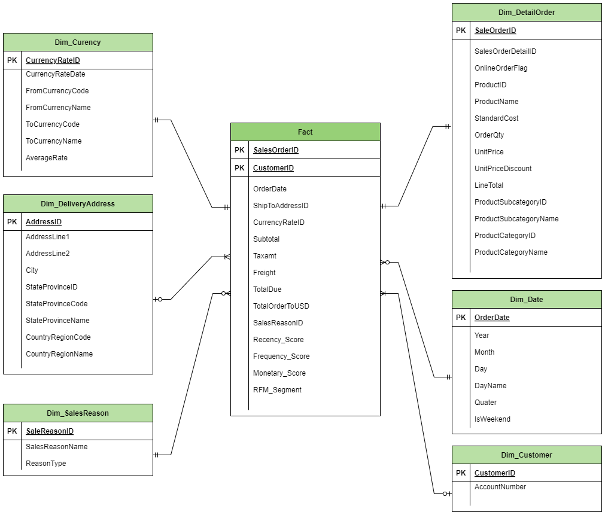

# Bicycle Store Data Warehouse

## Overview
This project implements a data warehouse for a bicycle store. The data warehouse is designed to consolidate data from various sources, transform it into a suitable format, and make it available for data analysis and visualization. The data pipeline leverages Apache Airflow for orchestration, Google BigQuery for data warehousing, and tools like Looker and Python for data visualization and mining.

## Data Pipeline

## ERD Database

## Star Schema

